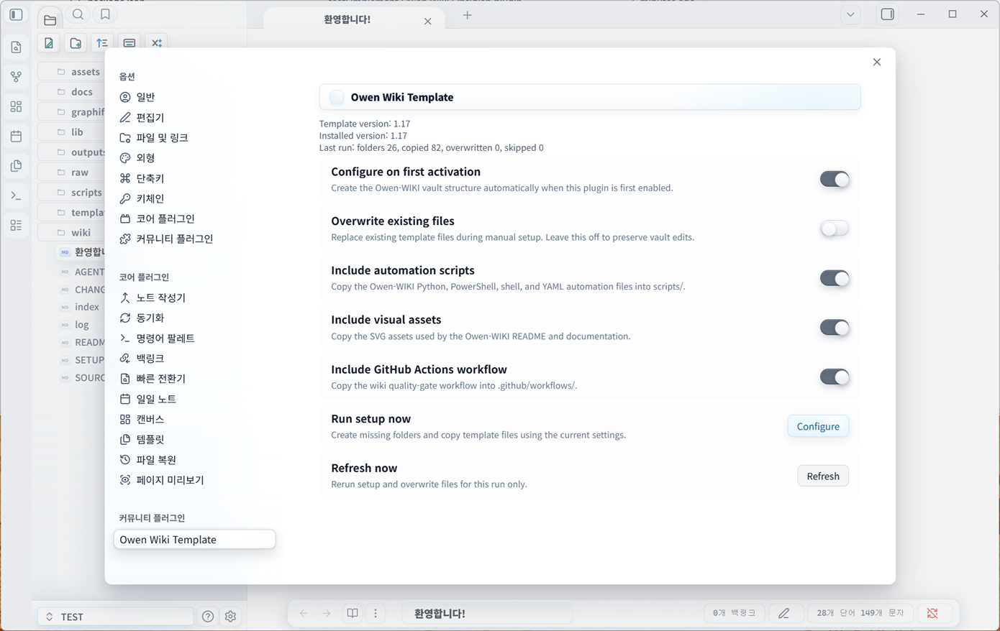

# Owen Wiki Template Obsidian Plugin

Owen Wiki Template is an Obsidian plugin that installs the Owen-WIKI Template Kit into the active vault. When the plugin is enabled, it can create the LLM wiki operating structure, starter pages, ontology templates, page templates, automation scripts, assets, and optional GitHub Actions workflow.



## Install

### Manual Install

1. Download `owen-wiki-1.20.0.zip` from the latest GitHub Release.
2. Extract it into `<your-vault>/.obsidian/plugins/owen-wiki/`.
3. Open Obsidian and enable community plugins if prompted.
4. Enable **Owen Wiki Template**.
5. Choose **Configure** in the first-run prompt or run **Configure Owen Wiki template** from the command palette.

The plugin asks before creating vault files on first activation. Existing files are skipped by default.

### BRAT Install

1. Install the Obsidian BRAT community plugin.
2. Add beta plugin repository `towishy/owen-wiki-plugin`.
3. Enable **Owen Wiki Template** after BRAT downloads the plugin.
4. Run the setup prompt or command palette action.

BRAT is useful for testing release builds before the plugin is distributed through the official community plugin browser.

## What It Creates

- `AGENTS.md`, `README.md`, `CHANGELOG.md`, `SETUP-GUIDE.md`, `index.md`, and `log.md`
- `raw/articles/YYYYMM/`, `raw/obsidian/Clippings/YYYYMM/`, and `raw/obsidian/outputs/YYYYMM/attachments/`
- `wiki/entities/`, `wiki/concepts/`, `wiki/summaries/`, `wiki/comparisons/`, `wiki/synthesis/`, and `wiki/ontology/`
- `templates/`, `scripts/`, `assets/`, `outputs/wiki-ops/`, and `graphify-out/`
- Optional `.github/workflows/wiki-lint.yml`

Existing files are skipped by default. Enable **Overwrite existing files** in the plugin settings only when you intentionally want to refresh template files.

## Setup Presets

- **Minimal**: core schema, starter wiki folders, ontology templates, and page templates.
- **Standard**: Minimal plus automation scripts and README visual assets.
- **Full**: Standard plus the GitHub Actions wiki quality-gate workflow.
- **Custom**: shown when you manually toggle scripts, assets, or workflow options.

## Commands

- **Configure Owen Wiki template**: creates missing template files and folders.
- **Refresh Owen Wiki template files**: reruns setup using the current settings.

After each run, the plugin shows a setup report with created, overwritten, and skipped file counts plus a compact file list.

## Safety Tools

- **Dry Run preview** shows the folders and files that would be created, copied, overwritten, or skipped without writing to the vault.
- **Back up before overwrite** saves replaced files under `.owen-wiki-backups/YYYYMMDDTHHMMSSZ/`.
- **Repair missing files** recreates only missing Owen-WIKI folders and files while preserving existing files.
- **Health check** validates required folders, required files, and the bundled `template-manifest.json`.
- **Setup report export** writes run history to `outputs/wiki-ops/setup-report-*.md`.
- **Open start document after setup** opens `wiki/synthesis/overview.md` when setup completes.

The plugin includes a left ribbon button for quick setup access. Settings and setup dialogs can be shown in English or Korean.

On mobile, use the plugin primarily for vault structure and Markdown document creation. The bundled Python and PowerShell automation scripts are intended for desktop environments.

## Development

Sync the bundled template kit from a local Owen-WIKI template repository:

```bash
npm run sync:template -- D:/Github/owen-wiki
```

Build and package the plugin:

```bash
npm install
npm test
npm run package
```

See [docs/testing.md](docs/testing.md) for the smoke test flow used with a local Obsidian test vault.

## Release Build

```bash
npm install
npm run package
```

The package script creates `release/owen-wiki-1.20.0.zip`, containing the Obsidian install files and bundled template kit.
