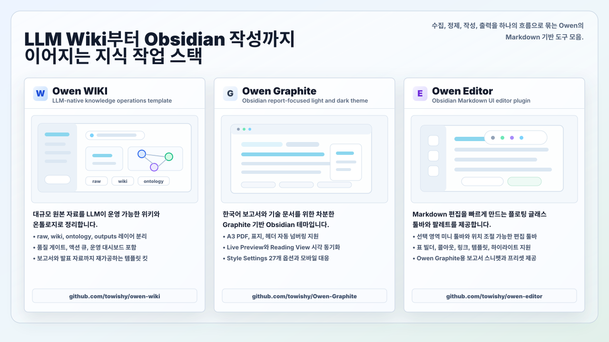
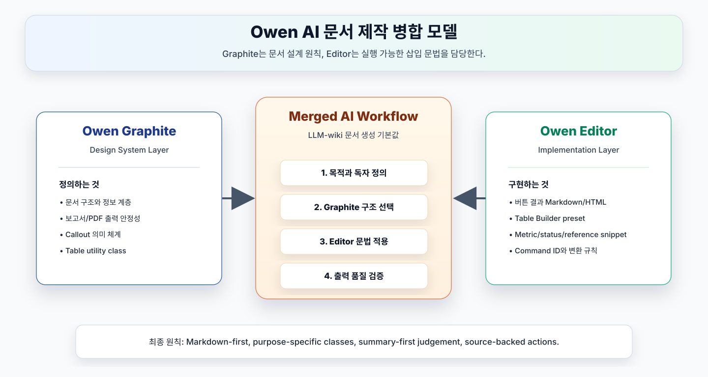
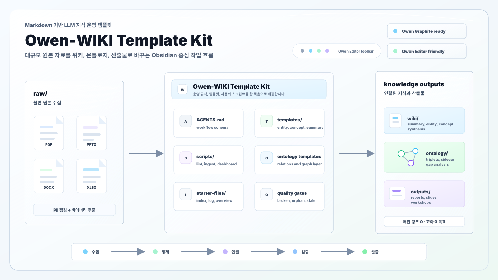

# Owen-WIKI Template Kit








Owen-WIKI is a Markdown-based knowledge operations template that helps LLM agents read large raw source collections and turn them into curated wiki pages, ontology relations, and reusable outputs. Together with Owen Graphite and Owen Editor, it forms an Obsidian-centered workflow for collecting knowledge, maintaining a graph, and producing reports.

> A self-growing personal knowledge system template built on **LLM Wiki + Knowledge Graph Ontology**.
> Use this kit to create a personal wiki with the same operating model as Owen's production WIKI repository.

**Version**: 1.17 (2026-05-26)

**Origin**: Based on Owen's LLM Wiki operating experience: 702 Microsoft Security domain pages, 7,451 wikilinks, 740 ontology relations, 10,097 raw episodes, and **27/27 Microsoft Security product coverage**.

**Based on**: Andrej Karpathy's LLM Wiki pattern, Nodus Labs knowledge graph extensions, LightRAG-style triplet extraction and reranking, and Graphiti-inspired temporal context graph design.

---

## 15 Core Features

1. **🤖 LLM-native knowledge base** — One `AGENTS.md` file defines autonomous ingest, query, lint, ontology, and output workflows. Humans provide raw inputs and review outputs.
2. **📂 3-layer separation** — `raw/` immutable inputs → `wiki/` LLM-curated knowledge → `outputs/` shared deliverables.
3. **🕸️ Ontology and gap analysis** — Stores `[[A]] [relation] [[B]]` triplets in `wiki/ontology/` alongside normal wikilinks to expose clusters, hubs, and missing areas.
4. **🧲 Auto cluster hubs (v1.7)** — Absorbs 4,000+ raw files through source registry hubs without requiring one manual ingest per file. Proven at **100% raw conversion coverage**.
5. **📋 Action Queue (v1.9)** — Generates registry promotion candidates, synthesis candidates, tag normalization candidates, and raw knowledge maturity grades.
6. **🧭 Ops Dashboard (v1.10)** — Unifies quality gates, action queue, promotion lifecycle, ontology sidecar, and episode metrics into one operational entry point.
7. **🎚️ Operations Precision (v1.11)** — Adds registry scoring, dedupe rules, lifecycle CLI operations, relation quality checks, and a target state of zero tag drift.
8. **🧪 Curation Automation (v1.12)** — Supports registry source sampling, lifecycle recommendations, synthesis expansion routing, and safe relation rewrites.
9. **🧬 Ontology Relation Refinement (v1.13)** — Reduces weak `related-to` links into canonical relations and runs a repeatable sidecar quality loop.
10. **🏗️ Architecture Hardening (v1.14)** — Uses canonical metrics, query-adjusted PageRank, strict sidecar parsing, and strict CI to prevent metric drift.
11. **⚙️ Operational Automation (v1.15)** — Includes query routing, graph hygiene, metrics snippets, related-to budget checks, graph delta reports, registry workbench packets, and release automation.
12. **⏱️ Temporal Provenance (v1.16)** — Records Graphiti-style `relation_id`, `episode_id`, `valid_at`, `invalid_at`, and raw source lineage in sidecar files and the episode ledger.
13. **🧭 Agent Behavioral Guardrails (v1.17)** — Uses assumption exposure, simplicity first, minimal change, and verification loops to improve LLM work quality.
14. **📊 Production-validated scale** — 702 pages, 7,451 wikilinks, 740 ontology relations, 10,097 raw episodes, zero broken links, and zero orphan pages.
15. **📦 Reusable template kit** — Packaged as an external Git repository so anyone can bootstrap the same LLM Wiki operating model.

---

## Why Owen-WIKI Extends The Early LLM Wiki Pattern

The early LLM Wiki pattern starts from a simple, powerful idea: an LLM reads raw sources, writes Markdown wiki pages, and maintains them over time. Owen-WIKI keeps that core idea, then adds the operational structure needed for large real-world repositories: schema, quality gates, ontology, bulk raw absorption, curation automation, and an output layer.

| Area | Early LLM Wiki | Owen-WIKI Template Kit |
| --- | --- | --- |
| Core philosophy | The LLM reads raw material and maintains a wiki | The same philosophy is encoded as executable operating rules in `AGENTS.md` |
| Structure | Raw Sources / Wiki / Schema | `raw/` → `wiki/` → `outputs/` plus a `wiki/ontology/` graph layer |
| Knowledge accumulation | Markdown pages and wikilinks | Validated at 702 pages, 7,451 wikilinks, 740 ontology relations, and 10,097 raw episodes |
| Query behavior | Index and wikilink navigation | 5-route query strategy, relevance scoring, and query routing policy |
| Trust management | Source citation is possible, but lifecycle controls are light | `confidence`, `last_confirmed`, `stale_after`, `supersedes`, and `superseded_by` fields |
| Quality management | Periodic linting concept | Broken link, orphan, tag, stub, ontology, and dashboard quality gates |
| Bulk source handling | Mostly manual ingest | Binary extraction, auto cluster hubs, remaining raw registries, and promotion lifecycle |
| Ontology | Mostly wikilink-based | `[[A]] [relation] [[B]]` graph plus temporal/provenance JSONL sidecars |
| Outputs | The wiki itself is the main artifact | Reports, presentations, workshops, and other audience-specific deliverables |
| Reuse | Personal knowledge-base pattern | Copyable template kit with starter files, scripts, templates, and ontology templates |

The original flow is compact:

```text
raw source -> LLM summary -> wiki page -> query/lint refinement
```

Owen-WIKI turns that into a knowledge operations pipeline:

```text
raw/
    -> PII check
    -> extraction and clustering
    -> summary/entity/concept/synthesis pages
    -> ontology sidecar
    -> episode ledger
    -> action queue
    -> lifecycle and sampling
    -> output generation
    -> quality gates and dashboard
```

In short, the early LLM Wiki is the prototype of an LLM-native Markdown knowledge base. Owen-WIKI is an LLM-native knowledge operations platform designed to survive large source collections, domain knowledge, repeated deliverables, and ongoing maintenance.

---

## Benefits At A Glance

| Area | Benefit | Mechanism |
| --- | --- | --- |
| **Trust** | Track source richness per page | `confidence` from 0.0 to 1.0 with a five-level guide |
| **Lifecycle** | Automatically classify aging information | `last_confirmed` / `stale_after` plus 90-day aging and 180-day stale checks |
| **Versioning** | Explicitly replace old pages without deleting history | `supersedes` / `superseded_by` plus output-layer upgrade hints |
| **Privacy** | Block risky content before ingest | [sanitize-ingest.py](scripts/sanitize-ingest.py) checks nine PII patterns |
| **Search efficiency** | Reduce tokens during answers | 5-route strategy plus nine-factor relevance scoring |
| **Ingest precision** | Extract structured knowledge before writing pages | LightRAG-inspired ENTITIES / RELATIONS YAML |
| **Indexing cost** | Keep single-file updates cheap | 2-tier index plus Smart Diff 3-tier strategy |
| **Bulk absorption** | Handle 4,000+ files without one-by-one ingest | [auto-cluster-hubs.py](scripts/auto-cluster-hubs.py) + [absorb-remaining-uningested.py](scripts/absorb-remaining-uningested.py) |
| **Next-action automation** | Generate promotion, synthesis, and tag cleanup candidates | [wiki-action-queue.py](scripts/wiki-action-queue.py) |
| **Candidate precision** | Penalize generic registries and dedupe part-based candidates | [wiki-action-queue.py](scripts/wiki-action-queue.py) |
| **Ops dashboard** | Provide one entry point for quality, queue, lifecycle, ontology, and episodes | [wiki-ops-dashboard.py](scripts/wiki-ops-dashboard.py) |
| **Promotion lifecycle** | Track source registry candidates from candidate to promoted | [registry-promotion-lifecycle.py](scripts/registry-promotion-lifecycle.py) |
| **Representative sampling** | Select 3-5 source samples for registry review | [sample-registry-candidate.py](scripts/sample-registry-candidate.py) |
| **Machine-readable ontology** | Export relation weights, evidence, paths, temporal fields, and provenance | [build-ontology-sidecar.py](scripts/build-ontology-sidecar.py) |
| **Episode provenance** | Record raw sources as stable episodes and track derived wiki/ontology lineage | [build-episode-ledger.py](scripts/build-episode-ledger.py) |
| **Relation quality** | Identify weak `related-to` relations for replacement | [check-ontology-relations.py](scripts/check-ontology-relations.py) |
| **Relation rewrites** | Apply reviewed relation changes with dry-run/apply modes | [apply-ontology-relation-suggestions.py](scripts/apply-ontology-relation-suggestions.py) |
| **Ontology loop** | Manage weak relation budgets and confidence/evidence tiers | [check-ontology-relations.py](scripts/check-ontology-relations.py) + [build-ontology-sidecar.py](scripts/build-ontology-sidecar.py) |
| **Canonical metrics** | Refresh README/AGENTS metrics from repository facts | [wiki-stats.py](scripts/wiki-stats.py) + [update-metrics-snippets.py](scripts/update-metrics-snippets.py) |
| **Query router** | Downrank registry-only hubs for normal knowledge questions | [wiki-query.py](scripts/wiki-query.py) |
| **Graph hygiene** | Prevent placeholder, unknown, trailing-link, and escaped-alias graph pollution | [check-graph-hygiene.py](scripts/check-graph-hygiene.py) + [wiki_utils.py](scripts/wiki_utils.py) |
| **Release automation** | Bundle validation, metrics update, commit, tag, push, and GitHub Release steps with bare numeric release names such as `1.17` | [release-wiki.py](scripts/release-wiki.py) |
| **Agent work quality** | Reduce hidden assumptions, overdesign, unrelated edits, and unverified completion | Agent Behavioral Guardrails in `AGENTS.md` |
| **Integrity** | Automate structural quality checks | Tags, ontology, orphans, broken links, confidence decay, stubs, graph hygiene, related-to budget, action queue, dashboard, and relation quality |
| **Quality gates** | Enforce structure in PR workflows | [wiki-quality-gates.py](scripts/wiki-quality-gates.py) |
| **Domain depth** | Proven Microsoft Security coverage | Five-prefix tag system across hundreds of tags |
| **Output variety** | Create more than knowledge-base pages | PPTX, DOCX, HTML, Markdown, SVG, and Mermaid-ready outputs |
| **External source absorption** | Convert binary sources into Markdown | markitdown-first extraction with fallback engines |
| **Audit and rollback** | Keep every operation traceable | Git, append-only `log.md`, and immutable raw source policy |
| **Visualization** | Generate an interactive wiki graph | [wiki-graph-viz.py](scripts/wiki-graph-viz.py) with Louvain communities and HTML output |

## Canonical Metrics Block

For a new wiki project, run `scripts/wiki-stats.py --write-ops` and `scripts/update-metrics-snippets.py` to refresh this block from the actual repository metrics.

<!-- wiki-metrics:readme:start -->
| Metric | Value |
| --- | ---: |
| Wiki pages | **702** |
| Ontology files | 7 |
| Total lines | 63,046 |
| Total words | 356,661 |
| Wikilinks | **7,451** (10.6 average per page) |
| Tags | 651 |
| Raw source files | **5,902** |
| Ontology relations | **740** (temporal sidecar basis) |
| Raw episodes | **10,097** |
| Git commits | 170+ |

### Graph (`graphify-out`)

| Metric | Value |
| --- | ---: |
| Nodes (pages) | 674 |
| Edges (wikilinks) | 3,645 |
| Communities (Louvain) | 9 |
| Connected components | 1 |
| Orphan nodes | **0** |
| Broken links | **0** |
<!-- wiki-metrics:readme:end -->

## What's Included

### Core Documents And Templates

| File | Purpose | Use |
| --- | --- | --- |
| `README.md` | This overview and operating guide | Read first |
| `AGENTS.md` | LLM agent schema v1.17 | Copy into your project root and customize |
| `SETUP-GUIDE.md` | Step-by-step setup guide | Follow during setup |
| `CHANGELOG.md` | Template kit release history | Review version changes |
| `templates/` | Five wiki page templates | Copy into `templates/` |
| `starter-files/` | Starter `index.md`, `log.md`, and `overview.md` files | Copy into the project root |
| `ontology-templates/` | Starter ontology files | Copy into `wiki/ontology/` |

### Script Catalog (`scripts/`, 50 files)

#### Core linting and statistics

| Script | Purpose |
| --- | --- |
| `wiki-stats.py` | Compute page, tag, confidence, and repository metrics |
| `find-orphans.py` | Detect pages with zero inbound links |
| `check-tags.py` | Validate tag prefix compliance |
| `scan-broken-links.py` | Scan broken wikilinks |
| `check-ontology.py` | Validate ontology wikilink integrity and relation codes |
| `check-confidence-decay.py` | Apply 90-day aging and 180-day stale classification |
| `sanitize-ingest.py` | Run the Ingest 0 PII precheck |
| `extract-raw-sources.py` | Convert PPTX/PDF/DOCX/XLSX files to Markdown with markitdown-first extraction |

#### Bulk source absorption and cluster hubs

| Script | Purpose |
| --- | --- |
| `find-uningested-raw.py` | Scan unreferenced raw files with NFC normalization and special-character matching |
| `auto-cluster-hubs.py` | Group unreferenced raw candidates and create source registry hub summaries |
| `absorb-remaining-uningested.py` | Absorb remaining unreferenced files into existing hubs with routing rules |
| `absorb-uningested-subhubs.py` | Split remaining raw candidates into source registry sub-hubs |
| `apply-default-confidence.py` | Apply policy-based confidence and `last_confirmed` defaults |
| `backfill-confidence.py` | Backfill missing confidence metadata with heuristics |
| `rebalance-confidence.py` | Re-evaluate high-trust source types such as `type/mslearn` |
| `auto-extract-triplets.py` | Provide an LLM-oriented ENTITIES/RELATIONS extraction skeleton |
| `append-ontology.py` | Append deduped triplets to ontology Markdown files |
| `fix-broken-wikilinks.py` | Repair known broken wikilinks through an aliases dictionary |
| `fix-hub-sources.py` | Repair damaged cluster hub `sources` YAML |
| `gen-hub-category-index.py` | Build body indexes that group hub sources by subfolder |

#### Ontology, graph, and query operations

| Script | Purpose |
| --- | --- |
| `build-ontology-sidecar.py` | Convert Markdown ontology relations into JSONL with weights, evidence, temporal fields, and provenance |
| `build-episode-ledger.py` | Record raw sources as stable episodes and map derived wiki pages and ontology relations |
| `check-ontology-relations.py` | Report weak `related-to` relations that can be replaced by canonical relations |
| `apply-ontology-relation-suggestions.py` | Apply reviewed relation rewrites with dry-run/apply support |
| `check-related-to-budget.py` | Enforce the weak `related-to` relation budget in CI |
| `compute-pagerank.py` | Generate raw PageRank and query-adjusted ranking |
| `wiki-query.py` | Route candidate pages using body text, tags, category boosts, ontology weight, and query-adjusted PageRank |
| `wiki-graph-viz.py` | Build a wikilink graph, Louvain communities, interactive HTML, and graph reports |
| `check-graph-hygiene.py` | Detect placeholder, unknown, and trailing wikilink graph pollution |
| `wiki_utils.py` | Provide shared wikilink, frontmatter, token parsing, and escaped-alias normalization utilities |

#### Action queue, lifecycle, and operations dashboard

| Script | Purpose |
| --- | --- |
| `wiki-action-queue.py` | Generate registry promotion, synthesis, tag normalization, maturity, and ranking-hint queues |
| `registry-promotion-lifecycle.py` | Track candidates through candidate, sampled, promoted, deferred, and rejected states |
| `sample-registry-candidate.py` | Select 3-5 representative source samples for registry review |
| `registry-promotion-workbench.py` | Build compact review packets for registry promotion candidates |
| `wiki-ops-dashboard.py` | Combine quality gates, queues, lifecycle, ontology sidecar, graph hygiene, graph delta, and episode metrics |
| `weekly-gap-report.py` | Generate a weekly gap report from action queue and quality signals |
| `identify-stubs.py` | Identify stub pages and summarize cleanup candidates |
| `analyze-large-hubs.py` | Identify oversized hubs and generate split plans |
| `build-raw-to-wiki-map.py` | Build raw-to-wiki reference maps and coverage reports |
| `generate-outputs-backlinks.py` | Add output backlinks to wiki pages |

#### Release, metrics, tags, and folder operations

| Script | Purpose |
| --- | --- |
| `wiki-quality-gates.py` | Enforce broken link, orphan, tag, stub, ontology, graph hygiene, and related-to budget gates |
| `apply-tag-aliases.py` | Apply tag alias migrations from `tag-aliases.yml` |
| `tag-aliases.yml` | Store tag normalization aliases |
| `update-metrics-snippets.py` | Refresh README/AGENTS metrics blocks from canonical metrics |
| `graph-delta-report.py` | Report graph changes against a Git reference |
| `release-wiki.py` | Run validation, metrics update, commit, tag, push, and GitHub Release steps; release tags and GitHub Release titles use only bare numeric versions such as `1.17` |
| `organize-collection-by-month.ps1` | Move direct collection files into monthly `YYYYMM/` folders |
| `organize-outputs-by-month.ps1` | Move output documents into monthly folders based on frontmatter or mtime |
| `organize-outputs-attachments-by-month.ps1` | Move output attachments into monthly attachment folders |
| `sync-to-obsidian.ps1` | Sync the wiki into an Obsidian vault |

---

## Quick Start (5 Minutes)

```bash
# 1. Create a project folder.
mkdir my-wiki && cd my-wiki

# 2. Create the folder structure.
mkdir -p raw/articles \
         raw/obsidian/Clippings \
         raw/obsidian/outputs \
         wiki/{entities,concepts,summaries,comparisons,synthesis,ontology} \
         outputs/wiki-ops graphify-out templates scripts

# 3. Copy the Owen-WIKI kit files.
cp <path-to>/owen-wiki/AGENTS.md ./AGENTS.md
cp <path-to>/owen-wiki/starter-files/* ./
cp <path-to>/owen-wiki/templates/* ./templates/
cp <path-to>/owen-wiki/ontology-templates/* ./wiki/ontology/
cp <path-to>/owen-wiki/scripts/* ./scripts/
mkdir -p .github/workflows && cp <path-to>/owen-wiki/.github/workflows/wiki-lint.yml ./.github/workflows/

# 4. Open AGENTS.md and customize the domain, paths, and operating rules.

# 5. Initialize Git when you are ready.
git init && printf ".venv/\nraw/extracted/\ngraphify-out/\n" > .gitignore

# 6. Add the first source into raw/ and ask your LLM agent to ingest it.
#    The agent should run sanitize-ingest.py before ingest.
#    Large collections can be absorbed with auto-cluster-hubs.py.
```

See [SETUP-GUIDE.md](SETUP-GUIDE.md) for the full setup guide.

---

## Architecture Overview

```text
Knowledge Pipeline

raw/ inputs -> wiki/ curated knowledge + ontology -> outputs/ deliverables
                         ^                           ^
                         |                           |
                 relation extraction          gap-based generation
```

### Four Layers

| Layer | Owner | Role |
| --- | --- | --- |
| `raw/` | User | Immutable source material |
| `wiki/` | LLM | Curated knowledge pages |
| `wiki/ontology/` | LLM | Relation graph and gap analysis inside the wiki layer |
| `outputs/` | Shared | Final deliverables and working drafts |

### Five Page Types

| Type | Folder | Purpose | Example |
| --- | --- | --- | --- |
| Entity | `wiki/entities/` | People, organizations, tools, products, customers | `openai.md`, `python.md` |
| Concept | `wiki/concepts/` | Theories, frameworks, methods | `machine-learning.md` |
| Summary | `wiki/summaries/` | Source-based summaries | `attention-is-all-you-need.md` |
| Comparison | `wiki/comparisons/` | Comparison and trade-off analysis | `pytorch-vs-tensorflow.md` |
| Synthesis | `wiki/synthesis/` | Cross-source synthesis and hubs | `overview.md` |

### Core Workflows

| Workflow | Trigger | Core Behavior |
| --- | --- | --- |
| **Ingest** | New sources | PII precheck, triplet extraction, summary creation, entity/concept updates, ontology append |
| **Query** | User question | 5-route discovery, relevance scoring, query routing, and synthesized answer |
| **Lint** | Periodic maintenance | Contradiction, orphan, gap, decay, tag, ontology, and quality gate checks |
| **Ontology Update** | Large changes | Incremental relation updates, sidecar rebuild, gap analysis, and overview refresh |
| **Cluster Hub Absorb** | Large raw additions | `find-uningested-raw.py` -> `auto-cluster-hubs.py` -> `absorb-remaining-uningested.py` -> `gen-hub-category-index.py` |

### Version Milestones

| Version | Milestone |
| --- | --- |
| v1.3 | Triplet-first ingest and metadata-based relevance scoring |
| v1.4 | Confidence, lifecycle metadata, supersession, and PII precheck |
| v1.5 | NetworkX / Louvain graph visualization |
| v1.6 | Diagram standards and print-friendly palettes |
| v1.7 | Auto cluster hubs and 100% raw conversion coverage pattern |
| v1.9 | Action Queue and CI quality gates |
| v1.10 | Ops Dashboard and promotion lifecycle |
| v1.11 | Operations precision and relation quality reporting |
| v1.12 | Curation automation and safe relation rewrites |
| v1.13 | Ontology relation refinement loop |
| v1.14 | Architecture hardening and canonical metrics |
| v1.15 | Operational automation, query routing, graph hygiene, and release automation |
| v1.16 | Temporal provenance and episode ledger |
| v1.17 | Agent Behavioral Guardrails |

---

## Version Compatibility

This kit is versioned whenever Owen's WIKI operating model changes. See [CHANGELOG.md](CHANGELOG.md) for release history.

---

## Sponsor

[](https://github.com/sponsors/towishy)

---

## License

MIT — free to use, modify, and distribute.
